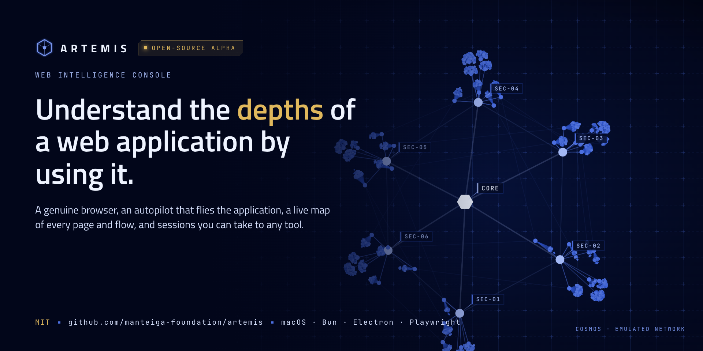
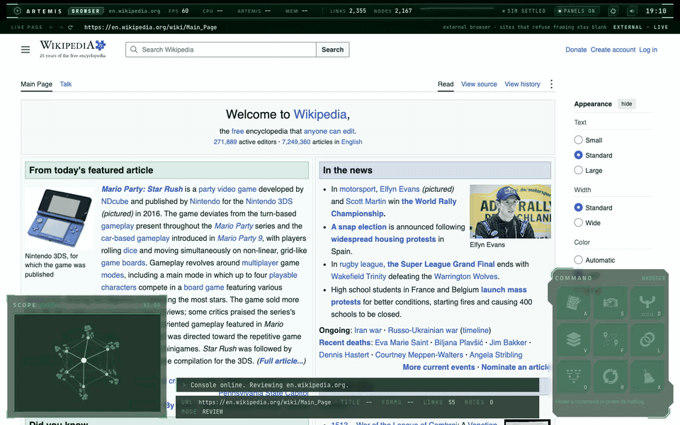
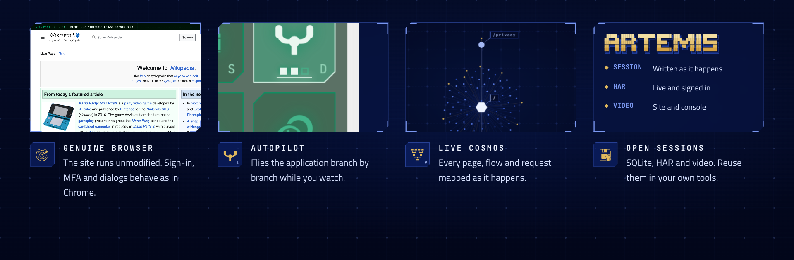
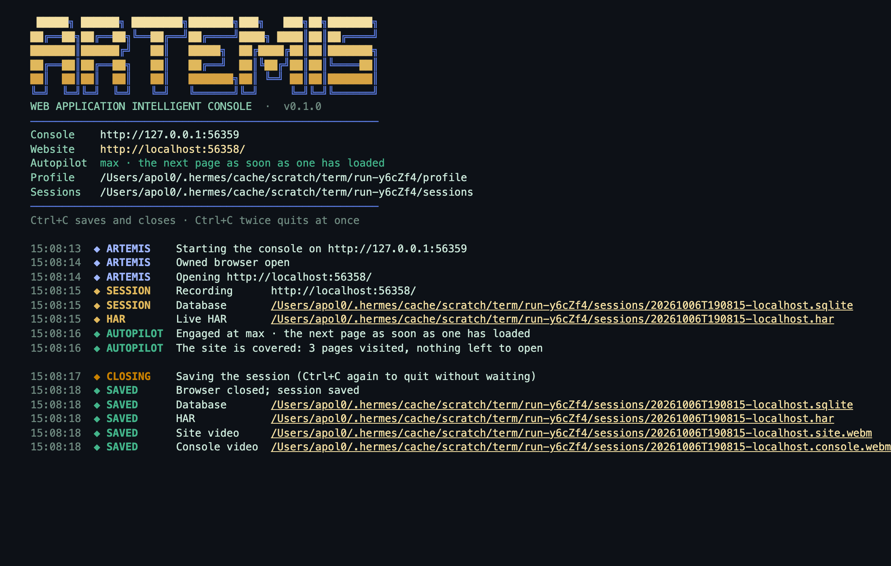

<p align="center">
  
</p>

<p align="center">
  
  <br>
  <sub>One key, <b>V</b>: from the live page to the whole application and back. Recorded in an ordinary browser on the emulated network; <a href="docs/readme/dive.mp4">full-quality video</a>. The page shown is Wikipedia's Main Page (CC BY-SA 4.0).</sub>
</p>

<p align="center">
  
</p>

# Artemis

Web intelligence console: understand the depths of a web application by using it.

- **Genuine browser.** The site runs unmodified in a window Artemis owns; sign-in, MFA and dialogs
  behave as in Chrome.
- **Autopilot.** Flies the application branch by branch while you watch, never signing out.
- **Live cosmos.** Every page, flow and request mapped as it happens; `V` dives between the page and
  the whole.
- **Open sessions.** One SQLite database per session, a live HAR other tools replay signed in, and
  video of the site and the console.

## Alpha

Artemis is alpha software. What is real today: the owned browser (an Electron window where the
website runs as a genuine page behind the console), the session recording into one SQLite database
per session, the live HAR written from it, videos of the site and the console, the autopilot that
flies a site on its own, and the live Cosmos drawn from the recording.

What is emulated, so the interface can be designed and tested before its functionality exists: in
an ordinary browser (`bun run dev`) the Cosmos is a generated network of about 2,000 nodes; the
Browser view's Annotate, Snapshot, Flow, Links, DOM and Clear commands answer as placeholders; the
header's `T/S`, `N/S` and `R/S` are a simulated feed; and in the configuration view only the sound
default is live. `docs/status.md` keeps the full list and the roadmap.

Session files are recorded unmasked (cookies, tokens, typed values) and stay under `data/`, which
git ignores; see `SECURITY.md`.


[](https://github.com/manteiga-foundation/artemis/actions/workflows/ci.yml)


## Requirements

- [Bun](https://bun.sh) 1.4 or newer (runtime, package manager, test runner).
- A Chromium for Playwright (tests):

```sh
bunx playwright install chromium
```

- Electron, for the browser Artemis owns, comes with `bun install`; its binary is fetched the first
  time it starts.

Artemis is developed and fully tested on macOS; the owned browser and the GPU flags used by the
tests are tuned for it (Metal via ANGLE). On Linux the CI job runs the type-check, the build and the
unit tests; the owned browser and the browser tests have not been run there yet.

## Install

```sh
git clone git@github.com:manteiga-foundation/artemis.git
cd artemis
bun install
```

## Run

Development server (open http://127.0.0.1:5173):

```sh
bun run dev
```

The browser Artemis owns (recommended): an Electron window where the website runs as a genuine
browser page behind the console, so sign-in flows, MFA, menus and dialogs behave as in any
browser. It starts the development server itself if nothing answers on the port:

```sh
bun run artemis                              # ARTEMIS_PORT=5179 bun run artemis  to use another port
bun run artemis example.com                  # engage the website at once
bun run artemis example.com --autopilot max  # and fly it on its own: slow, regular or max (-a, 1-3)
bun run artemis --help
```

The terminal opens with a large ARTEMIS welcome and what the run is, then one notification per
event: the session's database and live HAR with their full paths the moment they exist, the
autopilot's flight, closing, the files saved. `NO_COLOR=1` for plain text.



Its profile (cookies, logins) persists under `data/shell-profile`, which is ignored by git.

Experiments page (sounds, with a per-action picker): http://127.0.0.1:5173/debug

## Verify

```sh
bun run check              # type-check app, server and the Electron shell
bun run test               # unit tests + Playwright tests in real Chromium and Electron (several minutes)
bun run test:unit          # only the tests that need no browser or GPU, as CI runs them on Linux
bun run build              # check + production bundle in dist/
bun run preview            # serve dist/ at http://127.0.0.1:4173
```

## Screenshots and measurements

With a development server running on `<port>`:

```sh
bun run scripts/screenshots.ts <port> [outDir] [site]           # entry, views, dive frames, 1280 check
bun run scripts/screenshots-shell.ts <port> [outDir] [site]     # the owned browser (Electron shell), 1440 and 1280
bun run scripts/screenshots-recorded.ts <port> [outDir] [site]  # the live cosmos after browsing a real site
bun run scripts/screenshots-entry.ts <port> [outDir]
bun run scripts/screenshots-debug.ts <port> [outDir]
bun run scripts/measure-dive.ts <port>                          # frame rate idle and through the view dive
bun run scripts/icon.ts                                         # public/icon.svg -> shell/icon.png (the app icon)
bun run scripts/har.ts <session.sqlite> [out.har]               # a session's HAR 1.2 from its database (any session)
bun run docs/readme/make.tsx <port> [site]                      # the README's hero, features band and dive (GIF, MP4; needs ffmpeg)
```

Default output directory is `docs/screenshots/`.

## More

- `AGENTS.md` — how this repository is worked on: methodology, vocabulary, conventions, decisions.
- `CONTRIBUTING.md` — how to contribute: the red-first loop, gates, platforms and CI.
- `SECURITY.md` — how to report a security problem, and what the session files contain.
- `docs/status.md` — what is built, what is emulated, what comes next.
- `docs/console.md` — notes on the console as built: views, layout, commands, tests, browser approach.
- `docs/spikes/` — validated experiments kept for reference.

## Licence

MIT, see `LICENSE`. Third-party assets keep their own licences, listed below.

## Credits

- [Arwes](https://arwes.dev) (MIT) for frames, animators and bleeps. The shipped sound files are the
  free sample files from the Arwes repository and are used for development only.
- [cosmos.gl](https://cosmos.gl) (MIT) for the GPU graph.
- Icons: [Game-icons.net](https://game-icons.net) (CC BY 3.0) via `react-icons/gi`; the View glyph is
  Font Awesome Free (CC BY 4.0) via `react-icons/fa6`.
- Fonts: Titillium Web and JetBrains Mono (OFL) via Fontsource.
